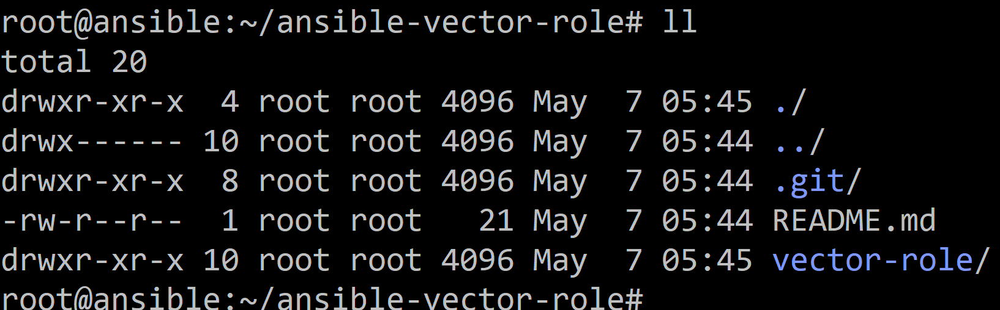

# Домашнее задание к занятию 4 «Работа с roles»

## Подготовка к выполнению

1. * Необязательно. Познакомьтесь с [LightHouse](https://youtu.be/ymlrNlaHzIY?t=929).
2. Создайте два пустых публичных репозитория в любом своём проекте: vector-role и lighthouse-role.

Создал:
https://github.com/DmitryIll/ansible-lighthouse-role
https://github.com/DmitryIll/ansible-vector-role 


3. Добавьте публичную часть своего ключа к своему профилю на GitHub.

Добавил.

## Основная часть

Ваша цель — разбить ваш playbook на отдельные roles. 

Задача — сделать roles для ClickHouse, Vector и LightHouse и написать playbook для использования этих ролей. 

Ожидаемый результат — существуют три ваших репозитория: два с roles и один с playbook.

**Что нужно сделать**

1. Создайте в старой версии playbook файл `requirements.yml` и заполните его содержимым:

   ```yaml
   ---
     - src: git@github.com:AlexeySetevoi/ansible-clickhouse.git
       scm: git
       version: "1.13"
       name: clickhouse 
   ```
Создал, только отступы скорректировал.


2. При помощи `ansible-galaxy` скачайте себе эту роль.

Скачал:

```
ansible-galaxy install -r requirements.yml -p roles
```

3. Создайте новый каталог с ролью при помощи `ansible-galaxy role init vector-role`.

Сначала подключил репозиторий git:

```
git clone https://github.com/DmitryIll/ansible-vector-role
```

Создал в отдельной папке внутри репозитория на ВМ с ansbile:

```
ansible-galaxy role init vector-role
```


Потом запушил в репозиторий удаленный.
Но, запушить через ssh ключ (не понял почему) -  не получилось, поэтому я создал персональный токен и использовал его - для пуша с ВМ.

Далее затянул код на ПК, и на нем доработал код для роли.

4. На основе tasks из старого playbook заполните новую role. Разнесите переменные между `vars` и `default`. 

Выполнил.

5. Перенести нужные шаблоны конфигов в `templates`.

Сделал.

6. Опишите в `README.md` обе роли и их параметры. Пример качественной документации ansible role [по ссылке](https://github.com/cloudalchemy/ansible-prometheus).

Описал для роли вектор.

7. Повторите шаги 3–6 для LightHouse. Помните, что одна роль должна настраивать один продукт.

Повторил. Создал роль для LightHouse и т.д.

8. Выложите все roles в репозитории. Проставьте теги, используя семантическую нумерацию. Добавьте roles в `requirements.yml` в playbook.

Поставил.

9. Переработайте playbook на использование roles. Не забудьте про зависимости LightHouse и возможности совмещения `roles` с `tasks`.

Выполнил.

10. Выложите playbook в репозиторий.

Выложил.

11. В ответе дайте ссылки на оба репозитория с roles и одну ссылку на репозиторий с playbook.


https://github.com/DmitryIll/ansible-lighthouse-role.git
https://github.com/DmitryIll/ansible-vector-role.git 

https://github.com/DmitryIll/ansible-roles/blob/main/README.md 

Для выполнения ползено обновить роли из репозиториев:

```
ansible-galaxy install -r requirements.yml -p roles --force
```
и запустить:

```
ansible-playbook -i inventory/prod.yml site.yml
```


---

### Как оформить решение задания

Выполненное домашнее задание пришлите в виде ссылки на .md-файл в вашем репозитории.

---
